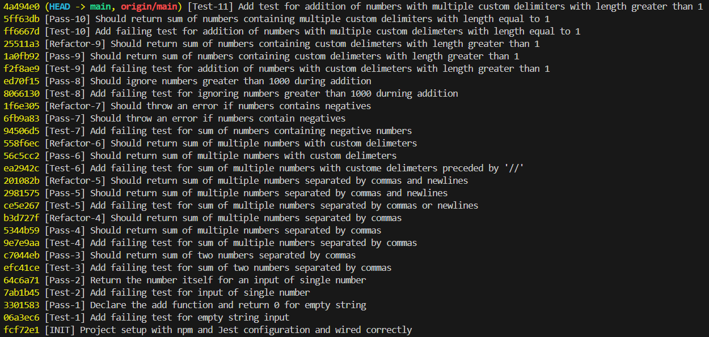
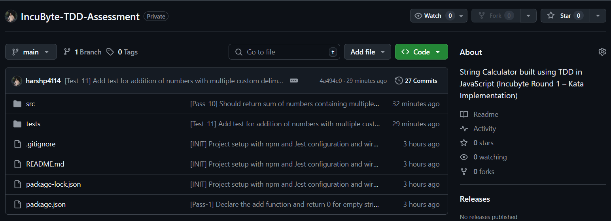

# 🧪 IncuByte-TDD-Assessment | Round 1

This project is a comprehensive showcase of building a String Calculator using the principles of Test-Driven Development (TDD) in JavaScript, powered by Jest for unit testing. Inspired by the classic String Calculator Kata, this implementation was part of the assessment round for Incubyte's hiring process. It highlights a disciplined, iterative approach to development—starting from minimal functionality, guided entirely by tests, and evolving through clean refactors. From handling custom and multi-character delimiters to validating edge cases and enforcing input rules, the project demonstrates thoughtful design and code quality backed by test coverage and a clear commit history.


---

## 📚 Table of Contents

- [🚀 Project Overview](#-project-overview)
- [🧠 TDD Flow & Philosophy](#-tdd-flow--philosophy)
- [🧪 Test Coverage](#-test-coverage)
- [🔁 Commit Walkthrough](#-commit-walkthrough)
- [🛠️ Features Implemented](#️-features-implemented)
- [📂 Project Structure](#-project-structure)
- [📦 Getting Started](#-getting-started)
- [✅ Running Tests](#-running-tests)
- [🤝 Acknowledgements](#-acknowledgements)

---

## 🚀 Project Overview

The goal of this project is to implement a `add()` function which takes a string of numbers and returns their sum. The string may contain numbers separated by:
- Commas `,`
- Newlines `\n`
- Custom delimiters defined using the `//` syntax

The project evolves step-by-step, with each test driving a small piece of functionality.

---

## 🧠 TDD Flow & Philosophy

This project strictly follows the **Red-Green-Refactor** TDD cycle:

1. **Red** — Write a failing test that describes a requirement.
2. **Green** — Write the minimum code to make the test pass.
3. **Refactor** — Clean up the implementation while keeping all tests green.

Each commit documents this process, clearly separating:
- `Test-N`: A new failing test
- `Pass-N`: Implementation to make the test pass
- `Refactor-N`: Refactoring for clarity and performance

---

## 🧪 Test Coverage

| Scenario | Covered |  
|----------|-----------|  
| Empty string returns 0 | ✅ |  
| Single number returns itself | ✅ |  
| Two numbers comma-separated | ✅ |  
| Multiple numbers comma-separated | ✅ |  
| Support for newline as delimiter | ✅ |  
| Custom single-character delimiter | ✅ |  
| Throw error for negative numbers | ✅ |  
| Ignore numbers > 1000 | ✅ |  
| Custom multi-character delimiter | ✅ |  
| Multiple custom delimiters | ✅ |  
| Multiple delimiters with varying lengths | ✅ |  

---

## 🔁 Commit Walkthrough

Here’s how the TDD story unfolded:

### ✅ Basic Scenarios
- **Test-1 → Pass-1**: Handle empty string
- **Test-2 → Pass-2**: Return single number
- **Test-3 → Pass-3**: Sum of two comma-separated numbers
- **Test-4 → Pass-4**: Multiple comma-separated numbers

### ✅ Adding Complexity
- **Test-5 → Pass-5**: Support newline and comma
- **Test-6 → Pass-6**: Support custom delimiter `//;\n1;2`
- **Test-7 → Pass-7**: Negative number check (throws error)
- **Test-8 → Pass-8**: Ignore numbers > 1000

### ✅ Advanced Features
- **Test-9 → Pass-9**: Custom delimiters of any length `[***]`
- **Test-10 → Pass-10**: Multiple custom single-character delimiters `[;][%]`
- **Test-11 → Pass-11**: Multiple delimiters of any length `[***][%%]`

Each `Refactor-X` commit improved structure, naming, or efficiency without altering behavior.

---

## 📂 Project Structure

```bash
.
├── src
│   └── stringCalculator.js          # Core add function and parsing logic
├── tests
│   └── stringCalculator.test.js     # Jest tests for TDD-driven development
├── .gitignore
├── package.json        # Project metadata and scripts
├── README.md           # Project documentation
```

---

## 📦 Getting Started

1. **Clone the repo**

```bash
git clone https://github.com/your-username/IncuByte-TDD-Assessment.git
cd IncuByte-TDD-Assessment
```

2. **Install dependencies**

```bash
npm install
```

---

## ✅ Running Tests

The project uses **Jest** for unit testing. Add a test script for Jest in the package.json file.

```bash
npm test
```

Tests follow a TDD naming format and are structured for traceability.

---

## 🤝 Acknowledgements

- 👨‍🏫 **IncuByte Assessment** for a clear, real-world TDD exercise
- 🧪 **Jest** for powerful testing
- 💡 Inspired by the classic *String Calculator Kata* by Roy Osherove

---

## 🧼 Screenshots

### 🔍 Commit History
A clean progression of TDD in action:


### 📦 GitHub Repo


---

> 🚀 This project was developed as a assessment for IncuByte's first round of disciplined test-driven development in JavaScript, reflecting quality-first programming habits.
